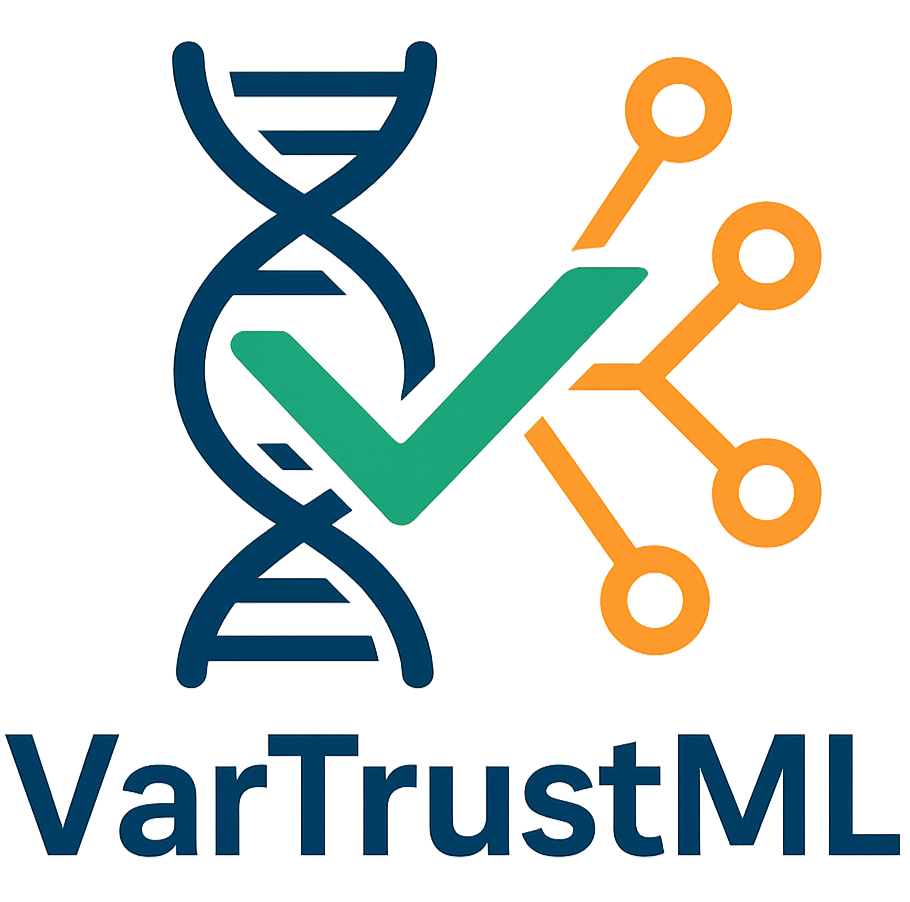

================================
VarTrustML Documentation
================================

.. raw:: html

   
<strong>Reliable Variant Calling Through Machine Learning Predictions</strong>

VarTrustML classifies structural variant calls as true or false positives, and
measures how far that classification can be trusted. These pages cover
installation, the command-line workflows, the Python API, and the statistical
machinery behind the reported numbers.

What is VarTrustML?
-------------------

Short-read SV callers disagree with each other and with the truth, so a call
alone says little about whether a variant is real. VarTrustML trains
classifiers on caller output plus alignment-derived features, then evaluates
them under nested cross-validation with the error bars, significance tests and
generalization checks a published comparison needs.

Models
------

Six classifiers are registered by default: Random Forest, XGBoost,
CatBoost, MLP, Logistic Regression and KNN. Hyperparameters are tuned by grid
search or by Bayesian optimization through Optuna.

Evaluation
----------

- Nested cross-validation with configurable outer and inner folds
- Probability calibration (isotonic or sigmoid) scored with ECE and MCE
- Bootstrap confidence intervals, bias-corrected and accelerated by default
- Paired McNemar and DeLong tests on pooled out-of-fold predictions, with
  Holm-Bonferroni or Benjamini-Hochberg correction
- Feature and feature-group ablation with significance testing
- SHAP attributions and confidence-stratified error analysis
- Cross-dataset matrices, generalization gap with CIs, and distribution-shift
  quantification

Running experiments
-------------------

Experiments are driven from the CLI or the Python API and configured through
JSON, so a run can be reproduced from its recorded config. Checkpoints let an
interrupted run resume; ``validate`` and dry-run mode catch configuration
errors before any model is fitted. Results are written as CSV alongside an
interactive HTML report. Logging has three levels (WARNING, INFO, DEBUG).

Quick Start
-----------

Installation
^^^^^^^^^^^^

.. code-block:: bash

   git clone https://github.com/EttoreRocchi/VarTrustML.git
   cd VarTrustML
   pip install .

Basic Usage
^^^^^^^^^^^

.. tab-set::

   .. tab-item:: CLI

      .. code-block:: bash

         # Model comparison
         vartrustml compare-models HG002.csv -t state --models "XGBoost,Random Forest"

         # With Optuna optimization
         vartrustml compare-models HG002.csv -t state --hpo-method optuna --optuna-trials 100

         # HTML report is generated by default (suppress with --no-html-report)
         vartrustml compare-models HG002.csv -t state

   .. tab-item:: Python API

      .. code-block:: python

         from vartrustml import ExperimentConfig, CrossValidationPipeline, DataLoader
         from vartrustml.config.experiment import CVConfig

         # Load data
         loader = DataLoader("data/")
         df = loader.load_dataset("HG002.csv")

         # Configure with Optuna
         config = ExperimentConfig(
             cv=CVConfig(seed=42, n_outer_splits=10, n_inner_splits=5),
             hpo_method="optuna",  # Use Bayesian optimization
             optuna_n_trials=100,
             generate_html_report=True,  # Generate interactive report
             models_to_use=["XGBoost", "Random Forest"]
         )

         # Run pipeline
         pipeline = CrossValidationPipeline(config)
         results = pipeline.run_cross_validation(df, "HG002")

Navigation
----------

.. grid:: 2
   :gutter: 3

   .. grid-item-card:: Getting Started
      :link: getting-started/index
      :link-type: doc

      Install VarTrustML and run your first experiment in minutes.

   .. grid-item-card:: User Guide
      :link: user-guide/index
      :link-type: doc

      Learn how to compare models, train, and analyze results.

   .. grid-item-card:: CLI Reference
      :link: cli-reference/index
      :link-type: doc

      Complete command-line interface documentation.

   .. grid-item-card:: API Reference
      :link: api/index
      :link-type: doc

      Python API documentation with autodoc.

Documentation Sections
----------------------

Getting Started
^^^^^^^^^^^^^^^

- :doc:`getting-started/installation` -- Install VarTrustML and dependencies
- :doc:`getting-started/quickstart` -- Get up and running quickly

User Guide
^^^^^^^^^^

- :doc:`user-guide/compare-models` -- Compare ML models with cross-validation
- :doc:`user-guide/training` -- Train individual models
- :doc:`user-guide/ablation-studies` -- Measure feature importance via systematic ablation
- :doc:`user-guide/hyperparameter-optimization` -- Grid search and Optuna
- :doc:`user-guide/calibration` -- Isotonic and sigmoid calibration, ECE and MCE
- :doc:`user-guide/threshold-optimization` -- Optimize classification thresholds
- :doc:`user-guide/html-reports` -- Generate interactive visualizations
- :doc:`user-guide/caller-comparison` -- Compare ML models to variant callers
- :doc:`user-guide/bootstrap-confidence-intervals` -- Interval estimates for every metric
- :doc:`user-guide/statistical-tests` -- Cliff's delta, power analysis, Holm-Bonferroni / Benjamini-Hochberg

Reference
^^^^^^^^^

- :doc:`cli-reference/index` -- Complete command-line documentation
- :doc:`api/index` -- Python API reference

Getting Help
------------

Bugs and feature requests go to `GitHub Issues
<https://github.com/EttoreRocchi/VarTrustML/issues>`_. For anything else,
write to ettore.rocchi3@unibo.it.

License
-------

VarTrustML is released under the MIT License.

.. toctree::
   :maxdepth: 2
   :hidden:
   :caption: Contents

   getting-started/index
   user-guide/index
   cli-reference/index
   api/index
   changelog

Indices and Tables
------------------

* :ref:`genindex`
* :ref:`modindex`
* :ref:`search`
